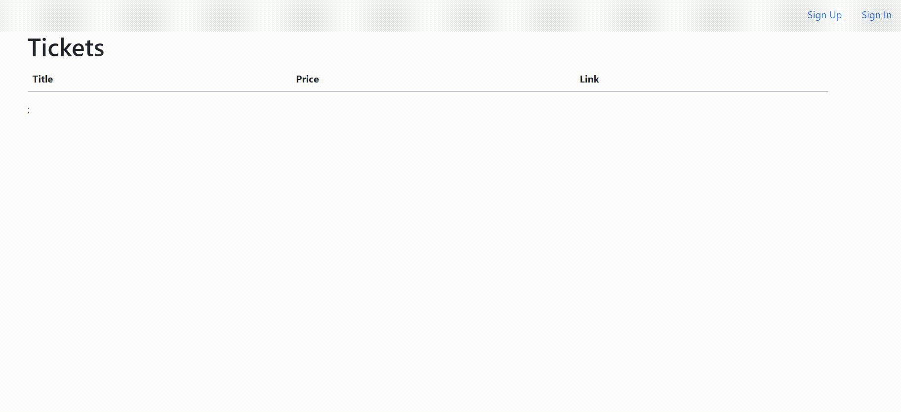

# Ticketing


A simple ticketing web app that alow user to sell and reserved a ticket.  
Built with microservice system utilize Docker and Kubernetes.  
Based on the tutorial of Stephen Grider.

## Getting Started

You need [Docker](https://www.docker.com/) and [Kuberbetes] enable on your machine.  
Using [Skaffold](https://skaffold.dev/) for automate pushing and deploying of Docker image.

### Installing

Navigate to the project forlder and run:

```
skaffold dev
```

### Usage



## Deployment

This demo run on http. To pass by the unsafe check, type 'thisisunsafe' with Chrome browser.  
Live demo-version is up on [Digital Oceans](http://www.vudo.store/)

## Built With

- [Next.js](https://nextjs.org/)
- [Docker](https://www.docker.com/)
- [NATS](https://docs.nats.io/)

## Authors

- **Dinh Vu** - *https://ogger77.github.io/*

## License

This project is licensed under the MIT License - see the [LICENSE.md](LICENSE.md) file for details
